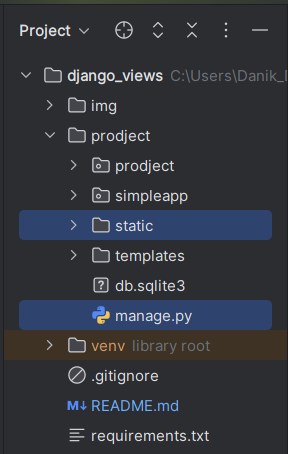
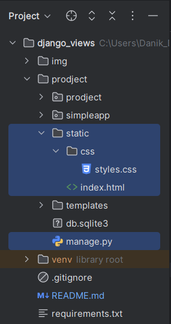
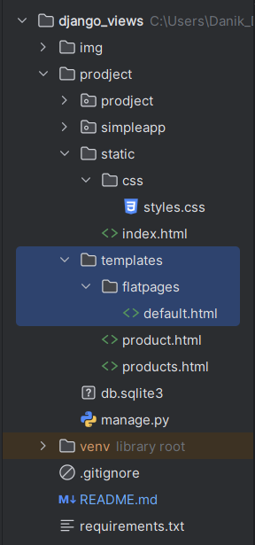

### Создаём виртуальное окружение:
    python -m venv venv
- - - 
### Активируем виртуальное окружение:
    venv\scripts\activate
- - - 
### Устанавливаем Django в свежее виртуальное окружение:
    py -m pip install Django==5.2.1
- - - 
### Запускаем команду создания проекта:
    py -m django startproject project
- - - 
### Переходим в директорию проекта:
    cd project

Здесь файл manage.py, который является точкой входа для управления проектом.

- - - 
### Также через консоль запустим следующую команду, которая создаст новое приложение news.
    py manage.py startapp simpleapp

## Базовая настройка Django flatpages ссылки
- - -
### В файле prodject/prodject/settings.py :
- - -
    SITE_ID = 1 # для корректной работы 'django.contrib.sites'
- - -
    В список INSTALLED_APPS добавляем строки :

        'django.contrib.sites', # для site в файле prodject/prodject/urls.py
        'django.contrib.flatpages', # для встроенного приложения flatpages применения стилей
- - - 
    В список MIDDLEWARE добавляем строку :
        
        MIDDLEWARE — это нечто вроде декораторов, которые применяются к абсолютно любой ссылке в веб-приложении и так же могут менять её поведение.
        'django.contrib.flatpages.middleware.FlatpageFallbackMiddleware', # для корректной работы встроенного приложения flatpages
- - - 
    В список TEMPLATES добавляем в 'DIRS'
        
        'DIRS': [os.path.join(BASE_DIR, 'templates')], # Путь до шаблонов
- - - 
    В конец файла добавить:
        
        STATICFILES_DIRS = [ BASE_DIR / 'static']
        Это настройка в Django, которая говорит:
        Ищи статические файлы (например, CSS, JavaScript, картинки)
        в папке static, которая находится внутри вашего проекта.
        BASE_DIR — это папка, где находится ваш проект.
        BASE_DIR / 'static' — это путь к папке static внутри вашего проекта.
- - - 
    В файле prodject/prodject/urls.py : 
        
        В список urlpatterns добавляем строку :
        path('pages/', include('django.contrib.flatpages.urls')), # для стилей
- - - 
### В файле django_views\prodject\prodject\urls.py
    from django.contrib import admin
    from django.urls import path, include
    
    urlpatterns = [
      path('admin/', admin.site.urls),
      path('pages/', include('django.contrib.flatpages.urls')), # для стилей
    ]
- - - 
- - -
### Создание администратора 
    
    python manage.py createsuperuser
    (admin admin)
- - -
- - - 
- - -
- - -
## Базовая настройка для стилей
- - -
### В директории с manage.py создаём папку static

### В папку static добавляем папки css, js и index.html

- - - -
### Создаем файл default.html (prodject/templates/flatpages/default.html)

### Редактируем файл на основе файла index.html (prodject/static/index.html)

    <!DOCTYPE html>
    <html lang="en">
        <head>
            <meta charset="utf-8" />
            <meta name="viewport" content="width=device-width, initial-scale=1, shrink-to-fit=no" />
            <meta name="description" content="" />
            <meta name="author" content="" />
            <title></title>
            <!-- Favicon-->

            <!-- подгружает static -->
            

            <link rel="icon" type="image/x-icon" href="assets/favicon.ico" />
            <!-- Core theme CSS (includes Bootstrap)-->

            <!-- Прописываем путь до файла-->
            <link href="" rel="stylesheet" />

        </head>
        <body>
            <!-- Responsive navbar-->
            <nav class="navbar navbar-expand-lg navbar-dark bg-dark">
                

                    <a class="navbar-brand" href="#">Start Bootstrap</a>
                    <button class="navbar-toggler" type="button" data-bs-toggle="collapse" data-bs-target="#navbarSupportedContent" aria-controls="navbarSupportedContent" aria-expanded="false" aria-label="Toggle navigation"></button>
                    

                        <ul class="navbar-nav ms-auto mb-2 mb-lg-0">
                            <li class="nav-item"><a class="nav-link active" aria-current="page" href="#">Home</a></li>
                            <li class="nav-item"><a class="nav-link" href="#">Link</a></li>
                            <li class="nav-item dropdown">
                                <a class="nav-link dropdown-toggle" id="navbarDropdown" href="#" role="button" data-bs-toggle="dropdown" aria-expanded="false">Dropdown</a>
                                <ul class="dropdown-menu dropdown-menu-end" aria-labelledby="navbarDropdown">
                                    <li><a class="dropdown-item" href="#">Action</a></li>
                                    <li><a class="dropdown-item" href="#">Another action</a></li>
                                    <li>
</li>
                                    <li><a class="dropdown-item" href="#">Something else here</a></li>
                                </ul>
                            </li>
                        </ul>
                    

                

            </nav>
            <!-- Page content-->

            

                

                    

                        
                        
                    

                

            

        </body>
    </html>
- - -
- - - 
- - -
### Подключил внешнее приложение simpleapp в список INSTALLED_APPS, в файле project/settings.py
Это позволит Django обнаружить созданное приложение.

    INSTALLED_APPS = [
    'django.contrib.admin',
    'django.contrib.auth',
    'django.contrib.contenttypes',
    'django.contrib.sessions',
    'django.contrib.messages',
    'django.contrib.staticfiles',

    'django.contrib.sites', # для site в файле prodject/prodject/urls.py
    'django.contrib.flatpages', # для встроенного приложения flatpages применения стилей

    'simpleapp', # <- (ПРИЛОЖЕНИЕ)
]
- - -
### Добавил приложению модели simpleapp/models.py
Обратите внимание, что мы дополнительно
указали методы __str__ у моделей.
Django будет их использовать, когда потребуется
где-то напечатать наш объект целиком.
Например, в панели администратора или в темплейте.
Вот как раз для вывода в HTML странице мы и указали,
как должен выглядеть объект нашей модели.
    from django.db import models
from django.core.validators import MinValueValidator

    # Товар для нашей витрины
    class Product(models.Model):
        name = models.CharField(
            max_length=50,
            unique=True, # названия товаров не должны повторяться
        )
        description = models.TextField()
        quantity = models.IntegerField(
            validators=[MinValueValidator(0)],
        )
        # поле категории будет ссылаться на модель категории
        category = models.ForeignKey(
            to='Category',
            on_delete=models.CASCADE,
            related_name='products', # все продукты в категории будут доступны через поле products
        )
        price = models.FloatField(
            validators=[MinValueValidator(0.0)],
        )
    
        def __str__(self):
            return f'{self.name.title()}: {self.description[:20]}'
    
    
    # Категория, к которой будет привязываться товар
    class Category(models.Model):
        # названия категорий тоже не должны повторяться
        name = models.CharField(max_length=100, unique=True)
    
        def __str__(self):
            return self.name.title()
- - -
### Зарегистрировал модели для приложения, simpleapp/admin.py (иначе мы не увидим их в админке)
    from django.contrib import admin
    from .models import Category, Product

    admin.site.register(Category)
    admin.site.register(Product)
- - - 
### Написал представление для приложения, simpleapp/views.py
    # Импортируем класс, который говорит нам о том,
    # что в этом представлении мы будем выводить список объектов из БД
    from django.views.generic import ListView, DetailView
    from .models import Product
    
    
    class ProductsList(ListView):
        # Указываем модель, объекты которой мы будем выводить
        model = Product
        # Поле, которое будет использоваться для сортировки объектов
        ordering = 'name'
        # Указываем имя шаблона, в котором будут все инструкции о том,
        # как именно пользователю должны быть показаны наши объекты
        template_name = 'products.html'
        # Это имя списка, в котором будут лежать все объекты.
        # Его надо указать, чтобы обратиться к списку объектов в html-шаблоне.
        context_object_name = 'products'
    
    
    # Вот так мы можем использовать дженерик ListView для вывода списка товаров:
    #
    # Создаем свой класс, который наследуется от ListView.
    # Указываем модель, из которой будем выводить данные.
    # Указываем поле сортировки данных модели (необязательно).
    # Записываем название шаблона.
    # Объявляем, как хотим назвать переменную в шаблоне.
    
    class ProductDetail(DetailView):
        # Модель всё та же, но мы хотим получать информацию по отдельному товару
        model = Product
        # Используем другой шаблон — product.html
        template_name = 'product.html'
        # Название объекта, в котором будет выбранный пользователем продукт
        context_object_name = 'product'
- - -
### Настроил адрес, для представления приложения, создав файл simpleapp/urls.py
    Чтобы любой пользователь приложения мог ознакомиться с товарами.
    Для этого необходимо настроить пути в файле urls.py.
    При выполнении команды инициализации нового приложения Django
    не создавал этот файл в нашей директории,
    поэтому сделал сам.
    from django.urls import path
    # Импортируем созданное нами представление
    from .views import ProductsList, ProductDetail
    
    urlpatterns = [
       # path — означает путь.
       # В данном случае путь ко всем товарам у нас останется пустым,
       # чуть позже станет ясно почему.
       # Т.к. наше объявленное представление является классом,
       # а Django ожидает функцию, нам надо представить этот класс в виде view.
       # Для этого вызываем метод as_view.
       path('', ProductsList.as_view()),
       # pk — это первичный ключ товара, который будет выводиться у нас в шаблон
       # int — указывает на то, что принимаются только целочисленные значения
       path('<int:pk>', ProductDetail.as_view()),
    ]
- - -
### Добавил отдельную ссылку products/ дял просмотр всех товаров в файле project/urls.py
    from django.contrib import admin
    from django.urls import path, include
    
    urlpatterns = [
        path('admin/', admin.site.urls),
        path('pages/', include('django.contrib.flatpages.urls')), # для стилей
    
        # Делаем так, чтобы все адреса из нашего приложения (simpleapp/urls.py)
        # подключались к главному приложению с префиксом products/.
        path('products/', include('simpleapp.urls')), # <---------- (ссылка products/)
        path('product/', include('simpleapp.urls')), # <----------- 
    ]
- - -
### Добавил 

- - -

### Запустить сервер
    
    py .\manage.py runserver

- - -

### Команда для создания миграций в Django,
    
    py manage.py makemigrations

запускает скрипт, который проходиться по всем классам,
от наследованного models.Mogel и смотрит были внесены какие-то изменения,
когда добавил в файл NewsPaper/news/models.py (приложение) информацию об БД
- - - 

### Применение миграции
    
    py .\manage.py migrate

- иногда после применения миграции возникают ошибки, кажется с начало вс ок,
  но потом вываливаются ошибки,
  нужно просто удалить в БД таблицу django_session,
  и применить миграцию ошибки исчезнут

Если возникает ошибки с БД в частности с моделями, то можно просто откатиться:
- Удалить файл - 0001_initial.py (NewsPaper/news/migrations/0001_initial.py)
- В БД удалить таблицы который создали, (приложение DBeaver)
- В БД переходим в таблицу django_migrations,  (приложение DBeaver)
  |    - нажимаем на | Данные |  (приложение DBeaver)
  |    - удаляем последнюю строчку записи (нажимаем на строку слева и на кнопку |-| (удалить запись внизу))  (приложение DBeaver)
  |    - обновляем/сохраняем таблицу (приложение DBeaver)

- иногда после применения миграции возникают ошибки, кажется с начало вс ок,
  |    - но потом вываливаются ошибки,
  |    - нужно просто удалить в БД таблицу django_session, (приложение DBeaver)
  |    - и применить миграцию ошибки исчезнут

from news.models import *

# Сначала создайте категорию, если её ещё нет
category = Category.objects.create(name='Бытовая химия')

# Затем создайте товар, указав ВСЕ обязательные поля
p_1 = Product.objects.create(name='Мочалка', description='Очень хорошо моет', quantity=10, category=category, price=299.99)

p_2 = Product.objects.create(name='Зубная Щётка', description='Классно чистит зубы', quantity=10, category=category, price=99.99)

echo "# django_views" >> README.md
git init
git add README.md
git commit -m "first commit"
git branch -M master
git remote add origin https://github.com/DS-975/django_views.git
git push -u origin master